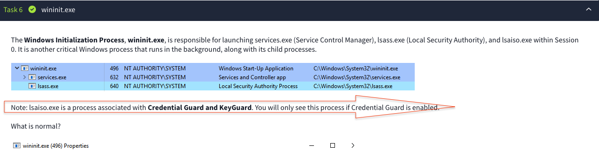
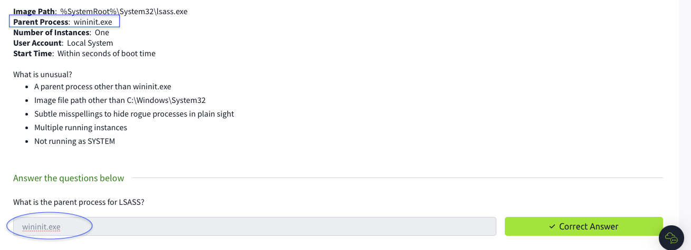

# coreWindowsProcesses
I have completed the course on core Windows processes on TryHackMe . Understanding these processes is crucial for detecting and responding to security threats. This knowledge is vital for investigations, as it helps differentiate between legitimate processes and potential threats, thereby enhancing overall system security and response capabilities. I have documented my learnings in this article.

## Understanding Core Windows Processes
Windows operating systems rely on a set of core processes to manage their functionality and maintain system stability. These processes are essential for the proper operation of the OS, each serving a specific role. Below is an overview of key Windows core processes and their functions.

1. System Process
At the core of Windows is the System process, which is uniquely identified by the Process ID (PID) 4. Unlike other processes that receive randomly assigned PIDs, the System process has a fixed PID. It operates exclusively in kernel mode.

2. Session Manager Subsystem (smss.exe)
The Session Manager Subsystem, known as smss.exe, is one of the first user-mode processes initiated by the kernel. Its primary role is to create and manage new sessions. Smss.exe is responsible for starting essential processes such as csrss.exe (Client Server Runtime Process) and wininit.exe in Session 0, which is designated for system operations. For user sessions, specifically Session 1, smss.exe starts csrss.exe and winlogon.exe. The process of smss.exe involves duplicating itself into new sessions and then terminating, facilitating the creation of new child processes.

3. Client Server Runtime Process (csrss.exe)
The csrss.exe process operates in user mode and is critical for system stability. Termination of csrss.exe can lead to a system crash. This process handles the Win32 console window and manages the creation and deletion of process threads. It loads several dynamic link libraries (DLLs) such as csrsrv.dll, basesrv.dll, and winsrv.dll. Additionally, csrss.exe provides the Windows API to other processes and oversees the Windows shutdown process.

4. Windows Initialization Process (wininit.exe)
Wininit.exe is responsible for launching several crucial processes within Session 0, including services.exe (Service Control Manager), lsass.exe (Local Security Authority). This process is integral to the background operations of Windows, ensuring that its child processes are properly initiated.

5. Service Control Manager (services.exe)
The Service Control Manager, known as services.exe, manages the various system services by loading, interacting, starting and ending. It maintains a database that can be queried using the Windows utility sc.exe. Services.exe is the parent process for several key processes, including svchost.exe, spoolsv.exe, msmpeng.exe, and dllhost.exe, each playing a role in system operations.

6. Service Host (svchost.exe)
The Service Host process, or svchost.exe, is responsible for hosting and managing Windows services. It plays a crucial role in the functioning of various system services, ensuring they run smoothly and efficiently.

7. Local Security Authority Subsystem Service (lsass.exe)
The Local Security Authority Subsystem Service (LSASS), known as lsass.exe, is crucial for enforcing security policies on Windows systems. It manages user authentication processes, including login attempts, password changes, and the creation of access tokens. Additionally, LSASS records security-related events in the Windows Security Log. Due to its role in handling sensitive security data, LSASS can be targeted by attackers using tools like Mimikatz to extract credentials.

8. Windows Logon Process (winlogon.exe)
Winlogon.exe manages the Secure Attention Sequence (SAS), which is activated by the CTRL+ALT+DELETE key combination. This process is also responsible for loading user profiles, ensuring users can access their personalized settings and data.

9. Windows Explorer (explorer.exe)
Explorer.exe provides users with access to their files and folders and supports additional features such as the Start Menu and Taskbar. This process is crucial for the user interface and overall navigation within the Windows environment.

When investigating security incidents, key details such as Image Path, Parent Process, Number of Instances, User Account, and Start Time are crucial for understanding and analyzing potential threats.

Image Path: Identifies the location of the executable, helping to distinguish legitimate processes from potentially malicious ones.

Parent Process: Reveals the origin of the process, indicating whether it was initiated by a trusted or suspicious source.

Number of Instances: Highlights unusual activity or excessive processes, which can signal malware infections.

User Account: Provides context on the privilege level and potential unauthorized access, showing if a process is running under an unusual or elevated account.

Start Time: Tracks when a process began, assisting in identifying the timeframe of potential infections or compromises.

##Task3 Correct Answer

##Task4

##Task4 Correct Answer

##Task5 

##Task5 Correct Answer

##Task6

##Task6 Correct Answer

##Task7 Correct Answer

##Task8 Correct Answer

##Task9 Correct Answer

##Task10 Correct Answer

##Task11 Correct Answer

##All Task Complete

